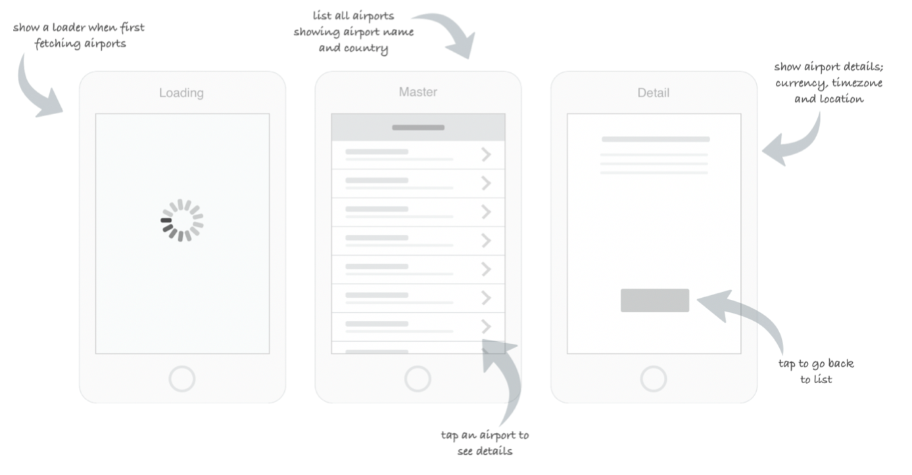

# Code Challenge (iOS)

## Brief

This test is not designed to trick you or be too challenging, it should give you the opportunity to show us how you work outside a face to face interview environment. You can take as long as you need to submit your solution, but this shouldn’t take up any more than 2-4 hours of your time.
We expect best practice approaches to design and development (structured git commits, clean well thought out code, testing and security considerations) but we are most interested in your approach to solving the given task, not how polished it looks.
Scenario
You have been tasked with the job of giving Qantas customers the ability to view which airports Qantas currently operates from. As part of this task you will build a native mobile app which will load the list of airports from an API and present them to users, as illustrated in the following wireframe:

An airports JSON API is available at:
https://api.qantas.com/flight/refData/airport

Must have(s):

1. Create a Git repository and add frequent, meaningful commits to show your work. ✅ 
2. Complete the above scenario using Swift (iOS) any frameworks of your choice. Keeping in mind we want to judge your ability, not that of third-party frameworks. At a minimum we require that the app will compile and run on a simulator/emulator. ✅ 
3. For the details screen, you should use whichever UI components you deem appropriate given the available airport details. ✅
4. Appropriate testing coverage. ✅
  
5. Include a README in the project’s root with detailed instructions on how to run and test your solution locally. ✅

Optional - Nice to have(s):
- Handle non-happy path scenarios such as API failures. ✅
- Handle no network connectivity (caching).
- Render on different device screen sizes and rotations. ✅
 

# Solution

The codebase in this repository is the solution to the problem mentioned above.

## How to install

No installation is needed, no third-party frameworks used, download the project and run on a simulator 
